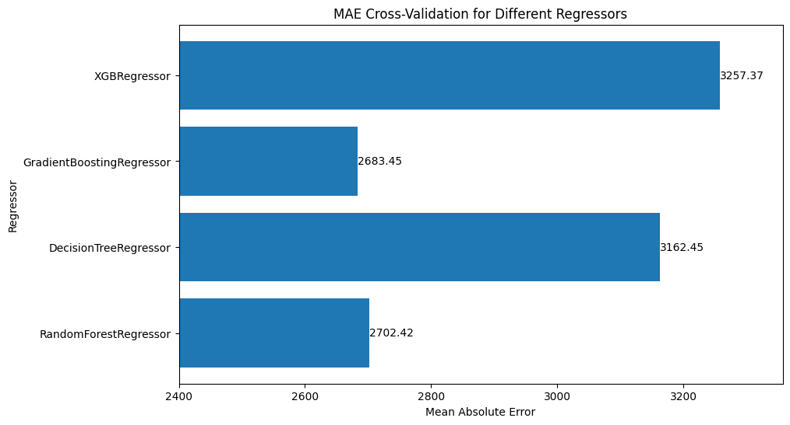
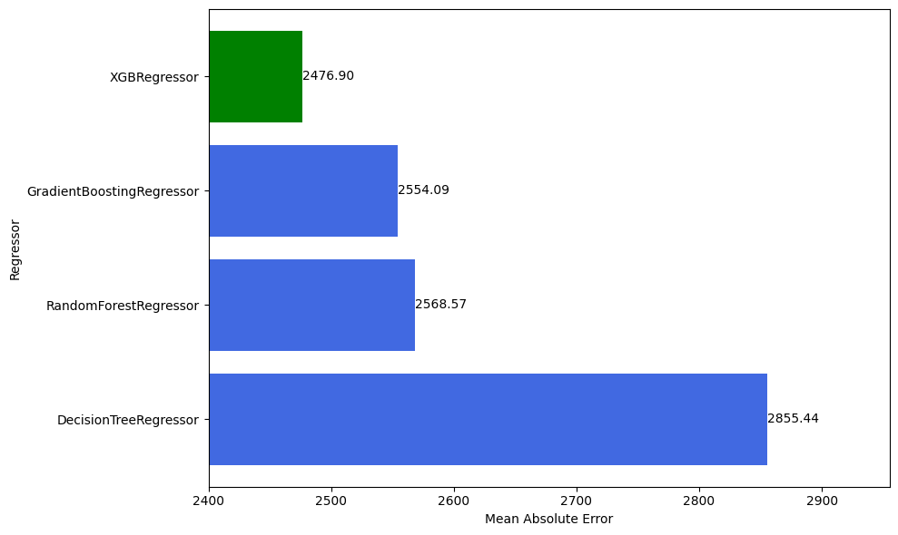
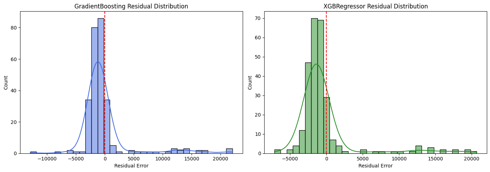
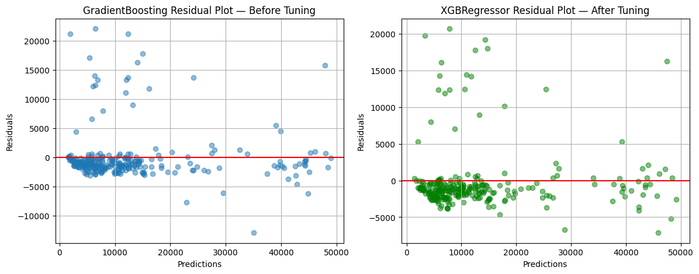
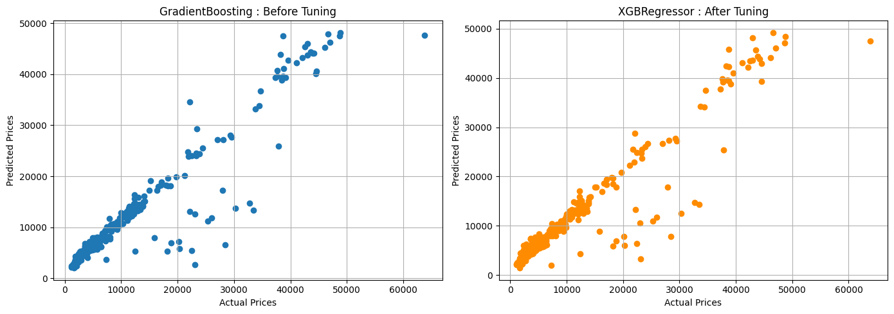

# Insurance Cost Prediction

This notebook explores an insurance dataset to predict individual medical costs. It performs exploratory data analysis (EDA), preprocesses the data, trains multiple regression models, and evaluates their performance.

## Dataset

The dataset contains information about individuals including:
- **age**: age of primary beneficiary
- **sex**: insurance contractor gender, female or male
- **bmi**: Body mass index, providing an understanding of body, weights that are relatively high or low relative to height, objective index of body weight (kg / m^2) using the ratio of weight to square of height
- **children**: Number of children covered by health insurance / Number of dependents
- **smoker**: Smoker or not
- **region**: the beneficiary's residential area in the northeast, southeast, southwest, northwest
- **charges**: Individual medical costs billed by health insurance

## Exploratory Data Analysis (EDA)

The notebook includes comprehensive visualizations to understand the relationships between different features and the target variable ('charges'):

- Scatter plot of charges by age and sex
- Linear regression plot of charges by age, smoker status, and sex
- Boxplot of charges by region and sex
- Boxplot of charges by number of children and smoker status
- Countplot of sex by smoker status
- Histogram of age distribution with KDE

### Key Insights from EDA
- Age and smoker status have strong positive correlations with charges (0.534 and 0.663 respectively)
- Number of children also shows a positive correlation with charges (0.133)
- Sex and region have minimal correlation with charges
- Smokers have significantly higher charges across all age groups
- Clear linear relationship between age and charges for smokers

## Data Preprocessing

### Feature Engineering
- **smoker_bmi**: Interaction feature (smoker indicator × BMI) - captures the combined effect of smoking on BMI-related charges
- **smoker_age**: Interaction feature (smoker indicator × age) - captures the combined effect of smoking and age on charges

These engineered features significantly improve model performance, especially for high-charge cases.

### Encoding Strategy
- **Numerical features** (age, bmi, children, smoker_bmi, smoker_age): StandardScaler normalization
- **region**: TargetEncoder (categorical to numerical based on target mean)
- **smoker, sex**: OneHotEncoder (categorical features)

### Train-Test Split
- Training set: 80%
- Testing set: 20%
- Random state: 42

## Model Training

Four regression models are trained and evaluated:
1. **Random Forest Regressor** - Ensemble method with decision trees
2. **Decision Tree Regressor** - Single tree-based model
3. **Gradient Boosting Regressor** - Sequential ensemble method
4. **XGBoost Regressor** - Extreme Gradient Boosting

All models are trained within a scikit-learn Pipeline for reproducibility and proper preprocessing.

## Model Evaluation

### Cross-Validation Results (Without Hyperparameter Tuning)

**MAE Scores:**
- **Random Forest Regressor**: MAE ≈ $2,702.42
- **Gradient Boosting Regressor**: MAE ≈ $2,683.45
- **Decision Tree Regressor**: MAE ≈ $3,162.45
- **XGBoost Regressor**: MAE ≈ $3,257.37

### Hyperparameter Tuning Results

After hyperparameter optimization, both Gradient Boosting and XGBoost models show improved performance. XGBoost particularly benefits from tuning, becoming competitive with Gradient Boosting.

**Key Findings:**
- Feature engineering with `smoker_bmi` and `smoker_age` provides more balanced predictions
- Both GBM and XGBoost have similar performance patterns but struggle with extremely high charges
- After feature engineering, prediction accuracy for high-charge cases improves significantly

## Model Residual Analysis

### Residual Distribution (Histogram)

Comparison of residuals between the top performing models (Gradient Boosting and XGBoost). The histograms show:
- Both models have similar residual distributions
- Some outliers present, particularly for extremely high charges
- Feature engineering helps balance the residuals
- Distribution is approximately centered around zero

### Residual Plot (Scatter)

Scatter plot showing residuals vs predicted values for both models:
- Reveals heteroscedasticity in prediction errors
- Models struggle with extreme high-value charges
- Feature engineering (`smoker_bmi` and `smoker_age`) significantly improves balance
- Both GBM and XGBoost show similar patterns

## Model Predictions vs Actual Values

Scatter plot comparing predicted charges against actual charges:
- Points close to the diagonal line indicate accurate predictions
- Both models perform well for typical charges
- Limitations visible for extremely high-charge cases
- Overall strong correlation between predicted and actual values

## Results Summary

**Top Performing Models:**
1. **Gradient Boosting Regressor** - Strong performance on this dataset
2. **XGBoost Regressor** - Comparable performance, especially after hyperparameter tuning

**Important Note:** These results are based on a relatively small dataset (1,338 samples). Performance and generalization on larger datasets cannot be guaranteed without additional validation on diverse data.

**Model Evaluation Metrics:**
- **Mean Absolute Error (MAE)**: Average absolute difference between predicted and actual values
- **Mean Squared Error (MSE)**: Average squared differences
- **Root Mean Squared Error (RMSE)**: Square root of MSE
- **Mean Absolute Percentage Error (MAPE)**: Average percentage error
- **R-squared**: Coefficient of determination

**Key Takeaways:**
- Feature engineering significantly improves model performance
- Gradient Boosting and XGBoost perform similarly on this dataset
- Models handle typical insurance charges well but struggle with extreme outliers
- Hyperparameter tuning provides incremental improvements in accuracy
- Results are dataset-specific; testing on larger/different datasets is recommended for robust conclusions

## How to Use This Project

1. Clone the repository
2. Install required dependencies: `pip install -r requirements.txt`
3. Run the Jupyter notebook: `jupyter notebook Insurance_Charges.ipynb`
4. Follow the analysis steps from EDA through model evaluation and hyperparameter tuning

## Requirements

- pandas
- numpy
- scikit-learn
- matplotlib
- seaborn
- xgboost
- jupyter
